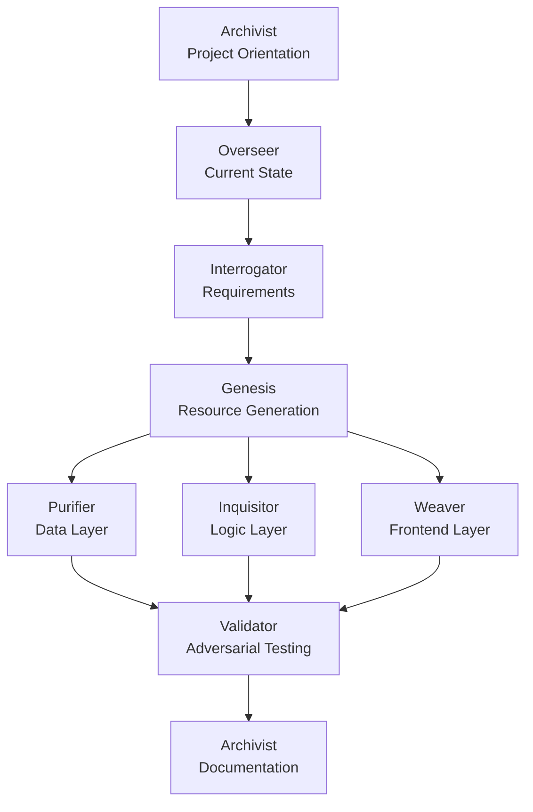

# EVE Skill Suite — Ecosystem Vitality Engines for Palantir Foundry

8 specialized Claude Code Skills covering the full Foundry project lifecycle — from requirement clarification to build, QA, documentation, and ongoing drift monitoring. Each skill is self-contained and can be used independently.

**English** | [繁體中文](./README.zh-TW.md)

---

## Prerequisites

- For use in AI FDE environments
- [Claude Code](https://claude.ai/code) CLI installed
- A Palantir Foundry environment (for actually deploying generated artifacts)
- Basic familiarity with Foundry concepts (Object Types, Action Types, Workshop, etc.)

---

## Installation

```bash
npx skills add github:q0015300153/eve-skills
```

**Verify** the installation:

```bash
npx skills list
```

All 8 `eve-*` skills should appear in the output.

**Update** to the latest version:

```bash
npx skills update eve-skills
```

**Remove:**

```bash
npx skills remove eve-skills
```

**Alternative — manual clone** (if you prefer to manage the files yourself):

```bash
git clone https://github.com/q0015300153/eve-skills.git
```

Then paste the content of any `skills/<skill-name>/SKILL.md` into your Foundry AIP Logic / Chatbot Studio system prompt configuration.

---

## Skills

| Skill | Full Name | What it does |
|---|---|---|
| `eve-interrogator` | Elucidation Vector Engine | Interrogator: When a request is vague, forces you to complete a technical multiple-choice quiz to figure out exactly what you need to build before work begins. |
| `eve-overseer` | Ecosystem Visibility Engine | Overseer: Scans the entire project's progress, draws real-time architecture diagrams, and tells the team exactly what to do next. |
| `eve-genesis` | Entity Vivification Engine | Genesis: From any use case, data schema, or business requirement, generates complete, deployable Foundry resources from scratch. |
| `eve-purifier` | Entity Viability Engine | Purifier: The data quality gatekeeper. Sets up strict health checks to block corrupted, duplicate, or garbage data from breaking your system. |
| `eve-inquisitor` | Entropy Vanguard Engine | Inquisitor: A merciless code review bot that hunts down inefficient, low-quality code and forces you to optimize for maximum performance. |
| `eve-weaver` | Experience Visualization Engine | Weaver: Designs zero-latency Workshop dashboards and React UIs, precisely wiring every widget to the correct data source and blocking any fetch that would slow down your interface. |
| `eve-validator` | Execution Validation Engine | Validator: Writes extreme test cases and fake data to actively try to "break" your code, ensuring it survives in production. |
| `eve-archivist` | Encyclopedic Vault Engine | Archivist: Deciphers messy, hard-to-understand code and automatically translates it into clear documentation and comments that anyone can understand. |

---

## Lifecycle Flow



---

## Design Principles

- **RIDs are always rendered in native format**: Use `:resource[rid]` syntax — never plain text or generic Markdown links.
- **No skill automatically invokes another**: `[WORKFLOW HANDOFF]` is advisory only — the human decides whether to switch.
- **Every Dead Reckoning requires explicit user acknowledgment**, with all assumed values flagged.
- **Unconfirmed content is always flagged**, never presented as fact.

---

## Contributing

Pull requests are welcome. Each skill lives in `skills/<skill-name>/SKILL.md` and is fully self-contained — no cross-skill dependencies at runtime.

---

## License

[MIT](./LICENSE)
