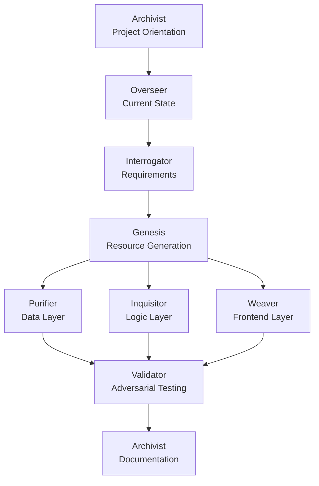
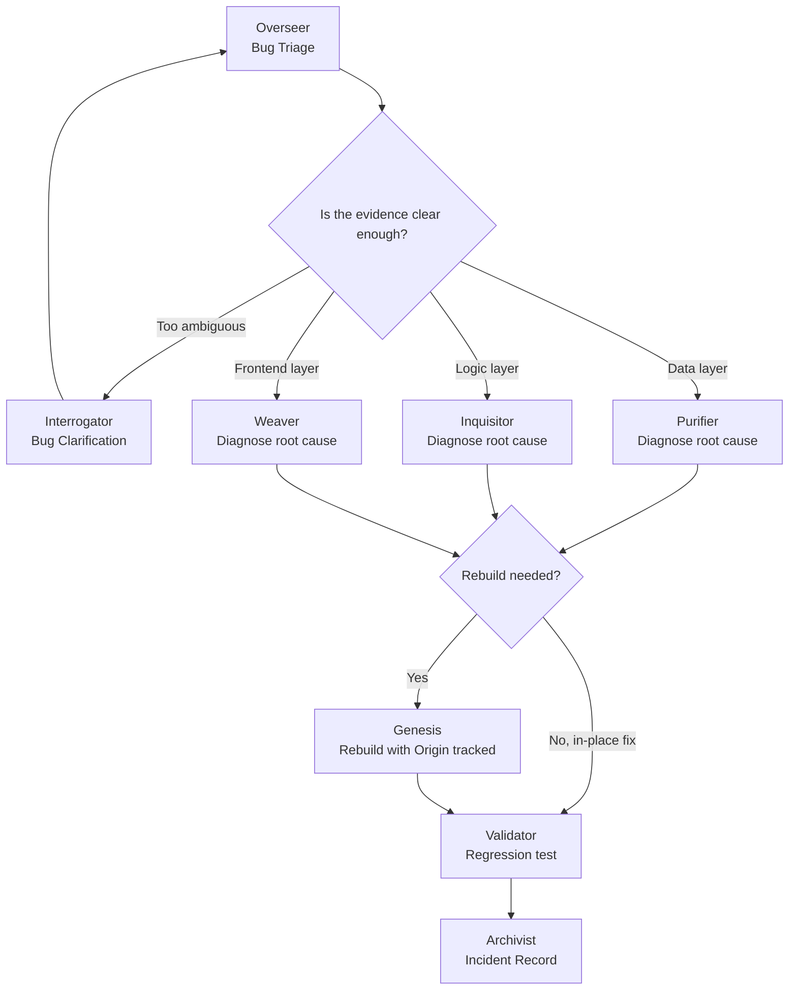

# EVE Skill Suite — Ecosystem Vitality Engines for Palantir Foundry

8 specialized Claude Code Skills covering the full Foundry project lifecycle — from requirement clarification to build, QA, documentation, ongoing drift monitoring, bug triage, resource cleanup, and data governance. Each skill is self-contained and can be used independently, with no cross-skill dependencies at runtime.

**English** | [繁體中文](./README.zh-TW.md)

---

## Prerequisites

- For use in AI FDE environments
- [Claude Code](https://claude.ai/code) CLI installed
- A Palantir Foundry environment (for actually deploying generated artifacts)
- Basic familiarity with Foundry concepts (Object Types, Action Types, Workshop, etc.)

---

## Installation

```bash
npx skills add github:q0015300153/eve-skills
```

**Verify** the installation:

```bash
npx skills list
```

All 8 `eve-*` skills should appear in the output.

**Update** to the latest version:

```bash
npx skills update eve-skills
```

**Remove:**

```bash
npx skills remove eve-skills
```

**Alternative — manual clone** (if you prefer to manage the files yourself):

```bash
git clone https://github.com/q0015300153/eve-skills.git
```

Then paste the content of any `skills/<skill-name>/SKILL.md` into your Foundry AIP Logic / Chatbot Studio system prompt configuration.

---

## Skills

| Skill | Full Name | What it does |
|---|---|---|
| `eve-interrogator` | Elucidation Vector Engine | Interrogator: When a request is vague, forces you to complete a technical multiple-choice quiz to figure out exactly what you need to build before work begins. When a bug report is too vague to route, switches to a dedicated symptom-clarification quiz to scope it before handing off to a specialist. |
| `eve-overseer` | Ecosystem Visibility Engine | Overseer: Scans the entire project's progress and draws real-time architecture diagrams; when something's reported broken but the layer is unclear, gathers evidence and triages it to the right specialist; scans the whole project for unused resources and lists cleanup candidates; tells the team exactly what to do next. |
| `eve-genesis` | Entity Vivification Engine | Genesis: From any use case, data schema, or business requirement, generates complete, deployable Foundry resources from scratch — scoping fields to what's actually needed, flagging fields that look sensitive by naming pattern, and keeping full root-cause traceability when the build is fixing a known bug, delivered one Tier at a time. |
| `eve-purifier` | Entity Viability Engine | Purifier: The data quality AND security gatekeeper. Sets up strict health checks to block corrupted, duplicate, or garbage data, and provides a formal classification level plus Marking/row-column security recommendations for any field flagged sensitive. |
| `eve-inquisitor` | Entropy Vanguard Engine | Inquisitor: A merciless code review bot that hunts down inefficient, low-quality code and forces optimization backed by real evidence; when investigating a specific bug, keeps the original symptom traceable all the way through to a confirmed fix. |
| `eve-weaver` | Experience Visualization Engine | Weaver: Designs zero-latency Workshop dashboards and React UIs, providing complete manual configuration steps for everything from adding a widget to API Name vs Display Name, and requiring explicit confirmation before wiring any field that looks sensitive into the UI. |
| `eve-validator` | Execution Validation Engine | Validator: Writes extreme test cases and fake data to actively try to "break" your code, ensuring it survives in production; once a regression test confirms a reported bug is actually fixed, flags it distinctly and hands it to the Archivist for the record so the incident isn't lost. |
| `eve-archivist` | Encyclopedic Vault Engine | Archivist: Deciphers messy, hard-to-understand code and automatically translates it into clear documentation and comments; also the final record-keeper for the debug workflow, preserving the symptom, root cause, fix, and regression test once a fix is validated. |

---

## Lifecycle Flow



---

## Debug Workflow

When a project is already live and something breaks, the path is different from starting a build from scratch:



`eve-overseer` is the only skill spanning every platform layer, making it the natural entry point for bug reports. If its own Drift Audit already explains the symptom (e.g. Action Type version drift), it resolves it directly rather than routing elsewhere.

---

## Cleanup & Data Governance

Beyond the main build pipeline, the family has two standing guardrails:

- **Unused resource cleanup** — `eve-overseer` scans **across the whole project** (Datasets, Object Types, Functions, Automate Rules, Workshop Modules, OSDK Packages, Branches/Proposals), while `eve-weaver` scans **within a single Workshop module** (variables and widgets). The two are complementary and never overlap — both only ever surface recommendations, never delete automatically.
- **Sensitive data protection chain** — `eve-genesis` flags fields matching sensitive naming patterns (`ssn`, `password`, `salary`, ...) and requires confirmation at build time; `eve-purifier` provides a formal classification level (Public / Internal / Confidential / Restricted) plus Marking/row-column security recommendations; `eve-weaver` cross-checks again before wiring any such field into a Workshop widget or OSDK query — never a silent exposure.

---

## Design Principles

- **RIDs are always rendered in native format**: Use `:resource[rid]` syntax — never plain text or generic Markdown links.
- **No skill automatically invokes another**: `[WORKFLOW HANDOFF]` is advisory only — the human decides whether to switch.
- **Every Dead Reckoning requires explicit user acknowledgment**, with all assumed values flagged — never silently assuming state is unchanged.
- **Unconfirmed content is always flagged**, never presented as fact.
- **Two distinct kinds of uncertainty**: `[⚠️ INFERRED]` means "a best guess from available evidence"; `[⚠️ VERIFY IN DOCS]` means "the platform mechanic itself isn't confidently known — check official documentation." The family never conflates the two, and never substitutes a guessed step for an honest "verify this yourself."
- **Concise by default, detailed on demand**: Most skills now lead with a scannable summary (pass/fail counts, a one-line verdict, severity breakdown) before any full detail — but the full rules, code, and operational steps that follow are never trimmed. What gets condensed is narrative/explanatory content, never anything the user has to act on (Manual Configuration Guide fields and Deployment Gate evidence are always shown in full).
- **Cross-session ledgers**: Every skill maintains its own ledger (Vigilance Ledger, Decision Ledger, Data Quality Ledger, Test Ledger, Documentation Ledger, Build Ledger, ...) tracking new/recurring/resolved/regressed findings, so nothing gets silently forgotten or re-reported across turns.
- **Sensitive data is never silently exposed**: Any field matching a sensitive naming pattern — or previously flagged — requires explicit confirmation before it's wired into anything user-facing. The skill never assumes it's fine.

---

## Traditional Development Version

Looking for the same skill suite for **general software development** (web systems, CLI tools, databases, servers, etc.) without Palantir Foundry?
A platform-agnostic port is maintained at **[q0015300153/nova-skills](https://github.com/q0015300153/nova-skills)**.

---

## Contributing

Pull requests are welcome. Each skill lives in `skills/<skill-name>/SKILL.md` and is fully self-contained — no cross-skill dependencies at runtime.

---

## License

[MIT](./LICENSE)
