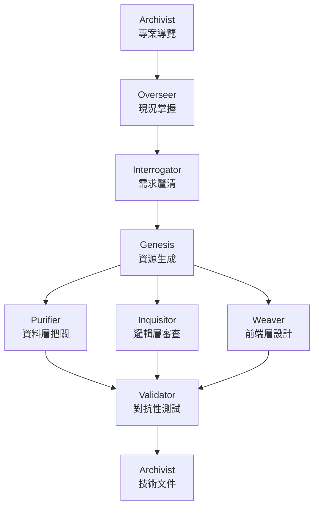
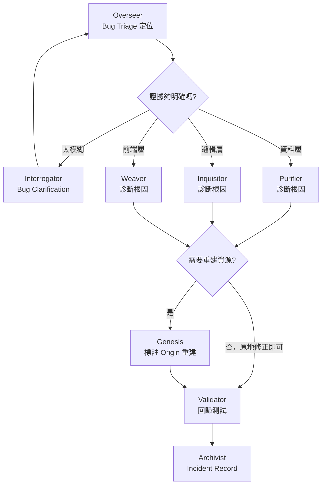

# EVE Skill Suite — Palantir Foundry 生態系活力引擎 (Ecosystem Vitality Engines)

8 個專業化的 Claude Code Skill，涵蓋 Foundry 專案的完整生命週期——從需求釐清、建置、QA、文件撰寫，到日常的版本飄移監控、Bug 分流除錯、資源清理與資料安全治理。每個 Skill 均為自包含設計，可獨立使用，執行階段不存在跨 Skill 的依賴關係。

[English](./README.md) | **繁體中文**

---

## 使用前提

- 用於 AI FDE 環境
- 已安裝 [Claude Code](https://claude.ai/code) CLI
- 具備 Palantir Foundry 環境（用於實際部署所生成的資源）
- 對 Foundry 基本概念有基礎認識（Object Type、Action Type、Workshop 等）

---

## 安裝

```bash
npx skills add github:q0015300153/eve-skills
```

**驗證**安裝是否成功：

```bash
npx skills list
```

應可在輸出中看到所有 8 個 `eve-*` Skill。

**更新**至最新版本：

```bash
npx skills update eve-skills
```

**移除：**

```bash
npx skills remove eve-skills
```

**替代方案 — 手動 clone**（適合希望自行管理檔案的場景）：

```bash
git clone https://github.com/q0015300153/eve-skills.git
```

然後將任意 `skills/<skill-name>/SKILL.md` 的內容貼入 Foundry AIP Logic / Chatbot Studio 的系統提示詞設定中。

---

## Skill 一覽

| Skill | 全名 | 職責 |
|---|---|---|
| `eve-interrogator` | Elucidation Vector Engine | 審訊者：當需求模糊時，強迫你完成一份技術多選題問卷，在動工前確實弄清楚自己要建造什麼；當 Bug 回報太模糊時，也能改用專屬的症狀釐清問卷，先鎖定範疇再交給對應專家。 |
| `eve-overseer` | Ecosystem Visibility Engine | 監督者：掃描整個專案進度，繪製即時架構圖；當使用者回報「東西壞了」但不確定是哪一層時，蒐集證據並分流到正確的專家；掃描全專案沒人使用的資源並列出清理建議；精確告知團隊下一步該做什麼。 |
| `eve-genesis` | Entity Vivification Engine | 創世紀：從任何使用情境、資料 Schema 或商業需求出發，從零生成完整、可直接部署的 Foundry 資源——會先篩選這次真正需要的欄位、用命名模式標記疑似機敏資料，並在修復已知 Bug 時保留完整的根因追溯鏈，一次一個 Tier 分段交付。 |
| `eve-purifier` | Entity Viability Engine | 淨化者：資料品質與安全守門員。設置嚴格的健康檢查阻止損壞、重複或垃圾資料，並針對任何被標記機敏的欄位提供正式的分類等級與存取控制（Marking / Row-Column Security）建議。 |
| `eve-inquisitor` | Entropy Vanguard Engine | 審判官：無情的程式碼審查機器人，專門獵殺低效、劣質程式碼，並強制你在有實測或可靠推論的證據下才最佳化；接手特定 Bug 調查時，全程保留原始症狀的追溯鏈直到修復驗證完成。 |
| `eve-weaver` | Experience Visualization Engine | 織造者：設計零延遲的 Workshop 儀表板與 React UI，為每個手動設定步驟（含怎麼新增元件、API Name vs Display Name）提供完整操作指南，並在把疑似機敏欄位接進畫面前強制要求確認。 |
| `eve-validator` | Execution Validation Engine | 驗證者：撰寫極端測試案例與假資料，主動嘗試「摧毀」你的程式碼，確保它能在生產環境中存活；一旦回歸測試確認某個回報過的 Bug 已修復，會明確標記並交由 Archivist 記錄，避免事件被遺忘。 |
| `eve-archivist` | Encyclopedic Vault Engine | 銘記者：解讀混亂、難以理解的程式碼，自動轉譯為任何人都能讀懂的清晰文件與注釋；同時是整個除錯流程的最終記錄站，收到修復驗證通知後完整保存症狀、根因、修復內容與回歸測試依據。 |

---

## 生命週期流程



---

## Debug 工作流

當專案已經上線、有人回報「東西壞了」時，走的是另一條路徑，而不是從頭重新建置：



`eve-overseer` 是唯一橫跨全部平台層級的 Skill，因此是 Bug 回報的天然入口；如果它自己的 Drift Audit 就能解釋症狀（例如 Action Type 版本漂移），會直接就地解決，不會多繞一手交給其他 Skill。

---

## 清理與資料治理

除了主線建置流程，家族內建兩種持續性的守護機制：

- **無用資源清理**——`eve-overseer` 負責**全專案跨資源**掃描（Dataset、Object Type、Function、Automate Rule、Workshop Module、OSDK Package、Branch/Proposal 都涵蓋），`eve-weaver` 負責**單一 Workshop 模組內部**的變數/元件清理，兩者互補、不重疊，而且都只列出建議，絕不自動刪除。
- **機敏資料防護鏈**——`eve-genesis` 建置時用命名模式（`ssn`、`password`、`salary`……）主動標記疑似機敏欄位並要求確認；`eve-purifier` 提供正式的分類等級（Public / Internal / Confidential / Restricted）與 Marking / Row-Column Security 建議；`eve-weaver` 在把任何欄位接進 Workshop Widget 或 OSDK 查詢前，會再交叉確認一次，絕不靜默曝露。

---

## 設計原則

- **RID 永遠以原生格式呈現**：使用 `:resource[rid]` 語法，而非純文字或一般 Markdown 連結。
- **Skill 不會自動呼叫另一個 Skill**：`[WORKFLOW HANDOFF]` 僅為建議指示，需由人工決定是否切換。
- **每個推算（Dead Reckoning）都需明確用戶確認**，且所有假設值均會標記旗標，絕不靜默假設狀態未變。
- **未經確認的內容永遠標注**，而非作為事實陳述。
- **兩種不確定性明確區分**：`[⚠️ INFERRED]` 代表「從現有證據推測」，`[⚠️ VERIFY IN DOCS]` 代表「平台機制本身不確定，需查官方文件」——全家族統一使用這組標記，絕不混用，也絕不用猜測的操作步驟取代誠實的「請自行確認」。
- **預設精簡，需要才展開**：大多數 Skill 現在會先給一個看得懂重點的摘要（通過/失敗統計、一行結論、嚴重度分佈），完整規則、程式碼、操作步驟依然完整保留在摘要之後——精簡的永遠是敘事性/說明性內容，不是使用者需要照做的操作型內容（例如 Manual Configuration Guide、Deployment Gate 的證據欄位一律不縮減）。
- **跨會話 Ledger 持續追蹤**：每個 Skill 都有對應的 Ledger（Vigilance Ledger、Decision Ledger、Data Quality Ledger、Test Ledger、Documentation Ledger、Build Ledger……），記錄新發現/復發/已解決/回歸的狀態，避免問題在多輪對話中被遺忘或重複回報同一件事。
- **機敏資料絕不靜默曝露**：任何符合機敏命名模式（或曾被標記過）的欄位，在被接進使用者看得到的介面之前，一律要求明確確認，絕不假設「應該沒關係」。

---

## 傳統開發版本

如果你需要在**傳統軟體開發**環境（網頁系統、終端機程式、資料庫、伺服器等）中使用相同的 Skill 套件，而不依賴 Palantir Foundry，
平台無關移植版本維護於 **[q0015300153/nova-skills](https://github.com/q0015300153/nova-skills)**。

---

## 貢獻

歡迎提交 Pull Request。每個 Skill 位於 `skills/<skill-name>/SKILL.md`，完全自包含——執行階段不存在跨 Skill 的依賴關係。

---

## 授權

[MIT](./LICENSE)
