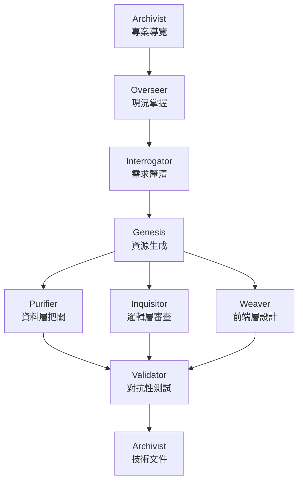

# EVE Skill Suite — Palantir Foundry 生態系活力引擎 (Ecosystem Vitality Engines)

8 個專業化的 Claude Code Skill，涵蓋 Foundry 專案的完整生命週期——從需求釐清、建置、QA、文件撰寫，到日常的版本飄移監控。每個 Skill 均為自包含設計，可獨立使用。

[English](./README.md) | **繁體中文**

---

## 使用前提

- 用於 AI FDE 環境
- 已安裝 [Claude Code](https://claude.ai/code) CLI
- 具備 Palantir Foundry 環境（用於實際部署所生成的資源）
- 對 Foundry 基本概念有基礎認識（Object Type、Action Type、Workshop 等）

---

## 安裝

```bash
npx skills add github:q0015300153/eve-skills
```

**驗證**安裝是否成功：

```bash
npx skills list
```

應可在輸出中看到所有 8 個 `eve-*` Skill。

**更新**至最新版本：

```bash
npx skills update eve-skills
```

**移除：**

```bash
npx skills remove eve-skills
```

**替代方案 — 手動 clone**（適合希望自行管理檔案的場景）：

```bash
git clone https://github.com/q0015300153/eve-skills.git
```

然後將任意 `skills/<skill-name>/SKILL.md` 的內容貼入 Foundry AIP Logic / Chatbot Studio 的系統提示詞設定中。

---

## Skill 一覽

| Skill | 全名 | 職責                                                                           |
|---|---|------------------------------------------------------------------------------|
| `eve-interrogator` | Elucidation Vector Engine | 審訊者：當需求模糊時，強迫你完成一份技術多選題問卷，在動工前確實弄清楚自己要建造什麼。                                  |
| `eve-overseer` | Ecosystem Visibility Engine | 監督者：掃描整個專案進度，繪製即時架構圖，並精確告知團隊下一步該做什麼。                                         |
| `eve-genesis` | Entity Vivification Engine | 創世紀：從任何使用情境、資料 Schema 或商業需求出發，從零生成完整、可直接部署的 Foundry 資源。                      |
| `eve-purifier` | Entity Viability Engine | 淨化者：資料品質守門員。設置嚴格的健康檢查，阻止損壞、重複或垃圾資料破壞整個系統。                                    |
| `eve-inquisitor` | Entropy Vanguard Engine | 審判官：無情的程式碼審查機器人，專門獵殺低效、劣質程式碼，並強制你最佳化至最高效能。                                   |
| `eve-weaver` | Experience Visualization Engine | 織造者：設計零延遲的 Workshop 儀表板與 React UI，將每個 Widget 精確接線至正確的資料來源，並阻止任何會拖慢介面的 Fetch。 |
| `eve-validator` | Execution Validation Engine | 驗證者：撰寫極端測試案例與假資料，主動嘗試「摧毀」你的程式碼，確保它能在生產環境中存活。                                 |
| `eve-archivist` | Encyclopedic Vault Engine | 銘記者：解讀混亂、難以理解的程式碼，自動轉譯為任何人都能讀懂的清晰文件與注釋。                                    |

---

## 生命週期流程



---

## 設計原則

- **RID 永遠以原生格式呈現**：使用 `:resource[rid]` 語法，而非純文字或一般 Markdown 連結。
- **Skill 不會自動呼叫另一個 Skill**：`[WORKFLOW HANDOFF]` 僅為建議指示，需由人工決定是否切換。
- **每個推算（Dead Reckoning）都需明確用戶確認**，且所有假設值均會標記旗標。
- **未經確認的內容永遠標注**，而非作為事實陳述。

---

## 傳統開發版本

如果你需要在**傳統軟體開發**環境（網頁系統、終端機程式、資料庫、伺服器等）中使用相同的 Skill 套件，而不依賴 Palantir Foundry，
平台無關移植版本維護於 **[q0015300153/nova-skills](https://github.com/q0015300153/nova-skills)**。

---

## 貢獻

歡迎提交 Pull Request。每個 Skill 位於 `skills/<skill-name>/SKILL.md`，完全自包含——執行階段不存在跨 Skill 的依賴關係。

---

## 授權

[MIT](./LICENSE)
